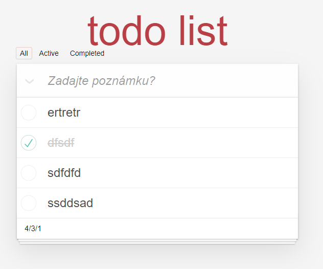
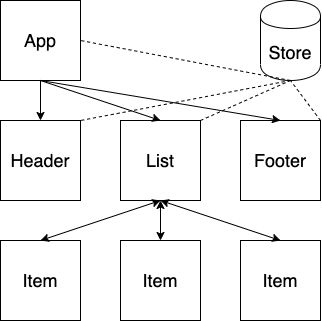

# TodoMVC built with React Hooks and Redux

The well-known TodoMVC built with React Hooks and Redux in a structured and testable way.

## Usage

After installing the dependencies the following NPM scripts become available:

- `start`: starts the application in development mode on [http://localhost:3000](http://localhost:3000)
- `build`: bundles the application for production into the `build` folder
- `test`: runs unit and E2E tests
- `test:unit`: runs unit tests with [Jest](https://jestjs.io/) in the `src` folder suffixed with `*.spec.js`
- `test:e2e`: runs E2E tests with [Cypress](https://www.cypress.io/) in the `tests/e2e` folder suffixed with `*.spec.js`
- `format`: formats the code with [Prettier](https://prettier.io/) within the `src` folder
- `lint`: lint files with [ESLint](https://eslint.org/) based on [Airbnb's styleguide](https://github.com/airbnb/javascript) and the Prettier config

## Component architecture

Application is compatible with [React devtools](https://chrome.google.com/webstore/detail/react-developer-tools/fmkadmapgofadopljbjfkapdkoienihi?hl=en) 
and [Redux devtools](https://chrome.google.com/webstore/detail/redux-devtools/lmhkpmbekcpmknklioeibfkpmmfibljd?hl=en)

## Series

This implementation is part of a series where the same application was implemented with the same architecture.

- [Vue](https://github.com/blacksonic/todomvc-vue)
- [Vue Composition API](https://github.com/blacksonic/todomvc-vue-composition-api)
- [Angular](https://github.com/blacksonic/todomvc-angular)
- [React](https://github.com/blacksonic/todomvc-react)
- [React Hooks](https://github.com/blacksonic/todomvc-react-hooks)
- [Svelte](https://github.com/blacksonic/todomvc-svelte)
# TODOmvc-react-hooks
